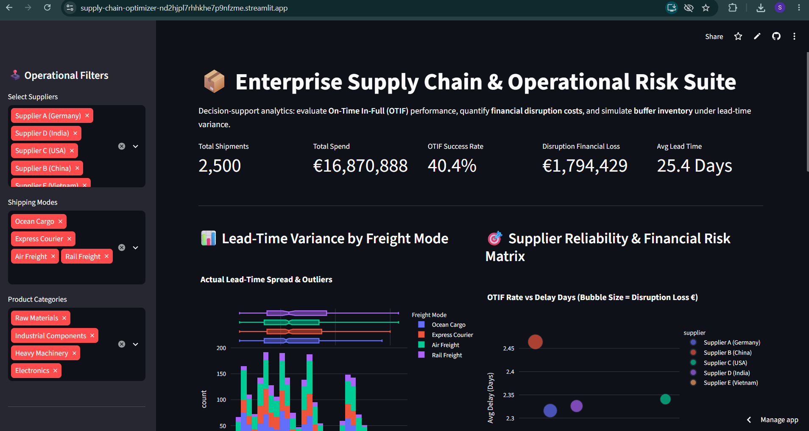
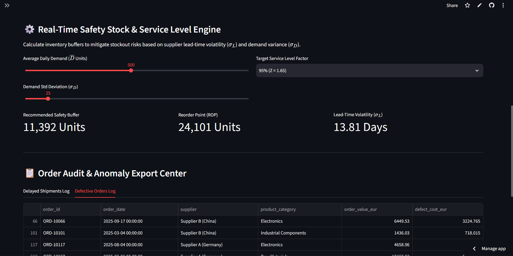
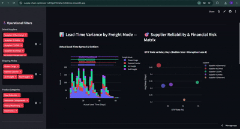

#  Global Supply Chain Risk & Operational Optimizer

[](https://supply-chain-optimizer-nd2hjpl7rhhkhe7p9nfzme.streamlit.app/)


An interactive, end-to-end supply chain analytics platform evaluating fulfillment volatility, supplier reliability, and inventory risk across multimodal global logistics networks.


###  Interface Snapshots

**1. Executive KPI Strip & Operational Variance Distributions**


**2. Safety Stock Simulation & Supplier Performance Matrix**


🔗 **Live Interactive Application:** [Launch Dashboard](https://supply-chain-optimizer-nd2hjpl7rhhkhe7p9nfzme.streamlit.app/)

---

##  Executive Overview & Core Problem

In enterprise logistics, fulfillment volatility directly impacts bottom-line profitability. Unreliable supplier timelines increase inventory holding costs and risk production line shutdowns.

This decision-support tool evaluates **2,500 multimodal shipment records** to:
1. **Track Fulfillment Quality:** Measure On-Time In-Full (OTIF) service rates across supplier tiers.
2. **Quantify Financial Exposure:** Dynamically calculate disruption costs resulting from delivery delays and defective shipments.
3. **Simulate Inventory Buffers:** Model optimal Safety Stock and Reorder Points (ROP) using lead-time and demand variance.

---

##  Key Features

* **Real-Time Dynamic Filtering:** Slices multi-tier data by suppliers, product categories, and logistics freight modes.
* **Lead-Time Variance Analysis:** Visualizes transit day distributions and outlier spreads via combined Histograms and Box Plots.
* **Supplier Risk & Financial Matrix:** Identifies underperforming partners by plotting OTIF rates against average delay penalties.
* **Inventory Simulation Engine:** Dynamically calculates warehouse buffer requirements:
  $$\text{Safety Stock} = Z \times \sqrt{\bar{L} \cdot \sigma_D^2 + \bar{D}^2 \cdot \sigma_L^2}$$
* **Audit & Export Center:** Instant CSV data extraction for flagged delays and defective shipments.

---

##  Tech Stack & Methodologies

* **Analytics & Modeling:** Python, Pandas, NumPy
* **Interactive Visualization:** Plotly Express
* **Application Framework:** Streamlit Community Cloud
* **Mathematical Concepts:** Lognormal/Exponential Distributions, Statistical Variance ($\sigma$), $Z$-Score Service Levels

---

##  Project Structure

```text
supply-chain-optimizer/
│
├── app.py                   # Main Streamlit dashboard application
├── generate_data.py         # Synthetic data pipeline generating supply chain anomalies


 ## Local Setup & Reproduction
To run this application locally:


# 1. Clone repository
git clone [https://github.com/YOUR_USERNAME/supply-chain-optimizer.git](https://github.com/YOUR_USERNAME/supply-chain-optimizer.git)
cd supply-chain-optimizer

# 2. Install dependencies
pip install -r requirements.txt

# 3. Generate dataset
python generate_data.py

# 4. Launch dashboard
streamlit run app.py


├── supply_chain_data.csv    # 2,500 record multimodal shipping dataset
├── requirements.txt         # Package dependencies for cloud deployment
└── README.md                # Project documentation and architectural overview


---

### Step 2: How to Update It on GitHub

1. Open your repository on [github.com](https://github.com).
2. Click on **`README.md`**.
3. Click the **Pencil icon** (Edit this file) near the top right of the file view.
4. Replace the text with the code above.
5. Scroll down and click the green button: **"Commit changes"**.

---

### Step 3: Add About Details on the Repository Homepage

On your main repository page:
1. Look at the right sidebar under the **About** section and click the **Gear icon** (Edit details).
2. **Description:** `Interactive enterprise supply chain risk dashboard modeling OTIF rates, lead-time variance, and safety stock buffers.`
3. **Website:** Paste your live link: `[https://supply-chain-optimizer-nd2hjpl7rhhkhe7p9nfzme.streamlit.app/](https://supply-chain-optimizer-nd2hjpl7rhhkhe7p9nfzme.streamlit.app/)`
4. **Topics / Tags:** Add `python`, `data-analytics`, `supply-chain`, `streamlit`, `plotly`, `operations-research`.
5. Click **Save changes**.


##  Live Application Demo & Previews

###  Animated Workflow


---

###  Full Video Walkthrough
Click below to view the high-resolution demonstration recording:

 **[Watch Full Dashboard Walkthrough (MP4)](Recording_using_dashboard.mp4)**
