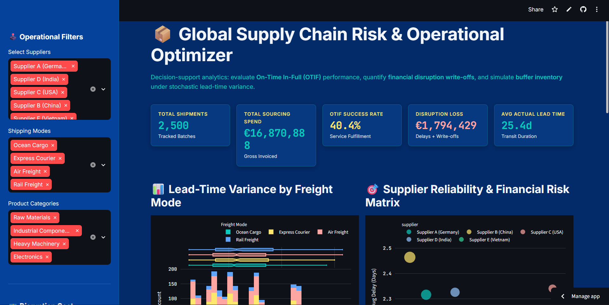
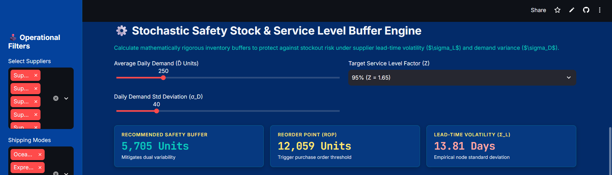
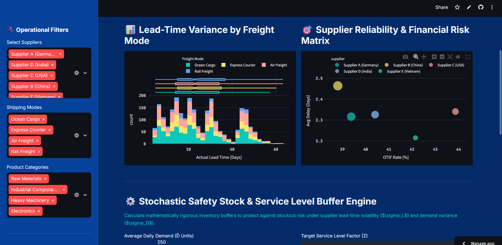
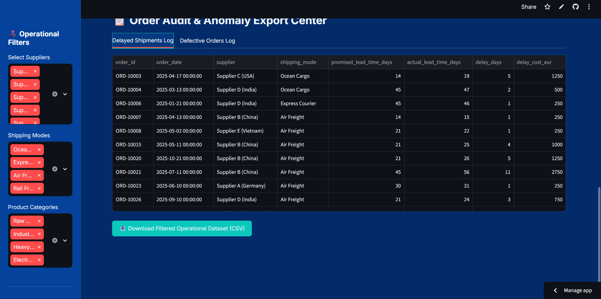

# 📦 Global Supply Chain Risk & Operational Optimizer

[](https://supply-chain-optimizer-nd2hjpl7rhhkhe7p9nfzme.streamlit.app/)
[](LICENSE)
[](https://www.python.org/)

An enterprise-grade operational risk analytics suite that evaluates **On-Time In-Full (OTIF)** fulfillment, quantifies **dynamic financial disruption penalties**, and simulates **stochastic buffer inventory** (Safety Stock & Reorder Points) under compound lead-time ($\sigma_L$) and demand ($\sigma_D$) volatility.

---

## 🎬 Live Platform Walkthrough

### Executive Terminal & Risk Engine Demo
https://github.com/user-attachments/assets/Dashboard_Preview.mp4

> **Interactive Cockpit:** Real-time multi-echelon filtering across suppliers, freight modes, and SKUs to quantify financial delay write-offs and optimize inventory thresholds.

---

## 📸 Platform Previews

### 1. Executive Cockpit & KPI Strip


### 2. Lead-Time Variance & Multi-Modal Spread


### 3. Supplier OTIF vs. Disruption Loss Matrix


### 4. Stochastic Safety Stock & Service Level Buffer Engine


---

## 📌 Executive Architecture & Problem Framing

Global procurement networks frequently suffer margin leakage caused by unmonitored supplier delay variance, defect write-offs, and stockouts. Traditional ERP dashboards report static historical averages without linking delivery variance to working capital risk.

This engine bridges descriptive logistics metrics with prescriptive financial controls by integrating:
1. **Dynamic Disruption Penalty Accounting:** Real-time calculation of late delivery penalties and defect write-offs tied to invoice values.
2. **Multi-Modal Transit Analytics:** Empirical lead-time distribution modeling across Air, Ocean, Rail, and Road freight.
3. **Dual-Variability Buffer Simulation:** Formulates safety stock ($SS$) and reorder point ($ROP$) policies accounting for simultaneous demand swings and supplier transit volatility.
4. **Audit & Anomaly Isolation:** Granular logging and immediate CSV export of non-compliant shipment batches.

---

## 🧮 Mathematical & Econometric Formulations

### 1. Dynamic Financial Disruption Loss Function
$$\text{Loss}_{\text{Total}} = \sum_{k=1}^{M} \left[ \Delta t_k \cdot C_{\text{delay}} + \mathbb{I}_{(\text{defective}_k)} \cdot V_k \cdot \rho_{\text{write-off}} \right]$$

Where:
* $M$: Total shipment count.
* $\Delta t_k = \max(0, t_{\text{actual}, k} - t_{\text{promised}, k})$: Delay duration in days.
* $C_{\text{delay}}$: Negotiated late penalty per day (€/day).
* $\mathbb{I}_{(\text{defective}_k)} \in \{0, 1\}$: Indicator variable for defective delivery.
* $V_k$: Gross invoice value of shipment $k$.
* $\rho_{\text{write-off}}$: Percentage financial penalty on defective batches.

### 2. Stochastic Safety Stock ($SS$) & Reorder Point ($ROP$) Engine
To protect service levels against dual supply and demand stochasticity:

$$SS = Z \cdot \sqrt{\overline{L} \cdot \sigma_D^2 + \overline{D}^2 \cdot \sigma_L^2}$$

$$ROP = (\overline{D} \cdot \overline{L}) + SS$$

Where:
* $Z$: Inverse cumulative normal distribution factor for target cycle service level (e.g., $Z = 1.65$ for $95\%$, $Z = 2.33$ for $99\%$).
* $\overline{D}$: Average daily demand volume.
* $\sigma_D$: Standard deviation of daily demand.
* $\overline{L}$: Empirical mean actual lead time across filtered suppliers.
* $\sigma_L$: Standard deviation of supplier lead time (transit volatility).

---

## 🚀 Key Modules

| Module | Core Logic | Business Impact |
| :--- | :--- | :--- |
| **Executive KPI Strip** | OTIF % & Aggregate Disruption Loss | Delivers top-line visibility into network reliability and unrecovered SLA penalties. |
| **Lead-Time Variance** | Histogram & Marginal Box Spread | Isolates fat-tail delays and transit outliers by shipping mode. |
| **Supplier Risk Matrix** | Multi-Variable Scatter / Bubble | Maps OTIF fulfillment against delay days, sizing nodes by net financial disruption loss (€). |
| **Inventory Buffer Simulator** | Non-Linear Variance Propagation | Determines exact safety stock and ROP quantities required to sustain target service levels without over-allocating working capital. |
| **Audit Center** | Automated Exception Filtering | Surfaces defective and delayed shipments with one-click audit CSV extraction. |

---

## 🛠️ Tech Stack

* **Language:** Python 3.10+
* **Data Processing & Analytics:** `Pandas`, `NumPy`
* **Visualization Suite:** `Plotly Express`, `Plotly Graph Objects`
* **Application Framework:** `Streamlit`

---

## 📦 Local Installation & Setup

1. **Clone the repository:**
   ```bash
   git clone [https://github.com/shuklasamyak1/supply-chain-optimizer.git](https://github.com/shuklasamyak1/supply-chain-optimizer.git)
   cd supply-chain-optimizer
